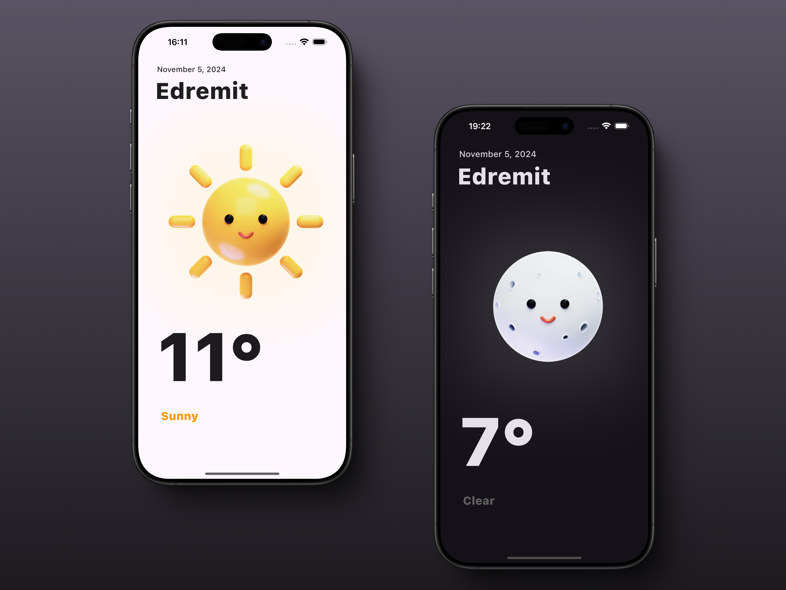

# 🌤️ WeatherApp

WeatherApp built with Flutter and Python.

## Overview

WeatherApp is a cross-platform weather application that provides real-time weather updates. The app is built using Flutter for the client-side and Python for the server-side.

## Features

- Real-time weather updates
- Supports both iOS and Android.
- Beautiful UI
- Fetches weather data from a reliable API

## Screenshots



## Demo Video

Watch the demo video to see the app in action:

[Demo Video](https://youtu.be/tv-oBduyGaY)

## Getting Started

### Prerequisites

- Flutter SDK: [Install Flutter](https://flutter.dev/docs/get-started/install)
- Python: [Install Python](https://www.python.org/downloads/)
- Weather API: [Get your API Key](https://www.weatherapi.com)

### Installation

1. Clone the repository:

   ```sh
   git clone https://github.com/yourusername/weatherapp.git
   cd weatherapp
   ```

2. Install Flutter dependencies:

   ```sh
   cd client
   flutter pub get
   ```

3. Install Python dependencies:

   ```sh
   cd ../server
   pip install -r requirements.txt
   ```

4. Create a `.env` file in the `server` directory and add your API key:
   ```sh
   echo "API_KEY=<your_api_key>" > .env
   ```

### Running the App

#### Client

To run the Flutter app on your desired platform:

```sh
cd client
flutter run
```

#### Server

To start the Python server:

```sh
cd server
python server.py
```

## License

This project is licensed under the MIT License - see the [LICENSE](LICENSE) file for details.

## Acknowledgements

- [Flutter](https://flutter.dev/)
- [Python](https://www.python.org/)
- [Weather API](https://www.weatherapi.com)
- [3D Weather Icons by Mikołaj Niznik](https://www.figma.com/community/file/1023658389987124693/mikoaj-niznik-3d-weather-icons)

## Contributing

Contributions are welcome!
